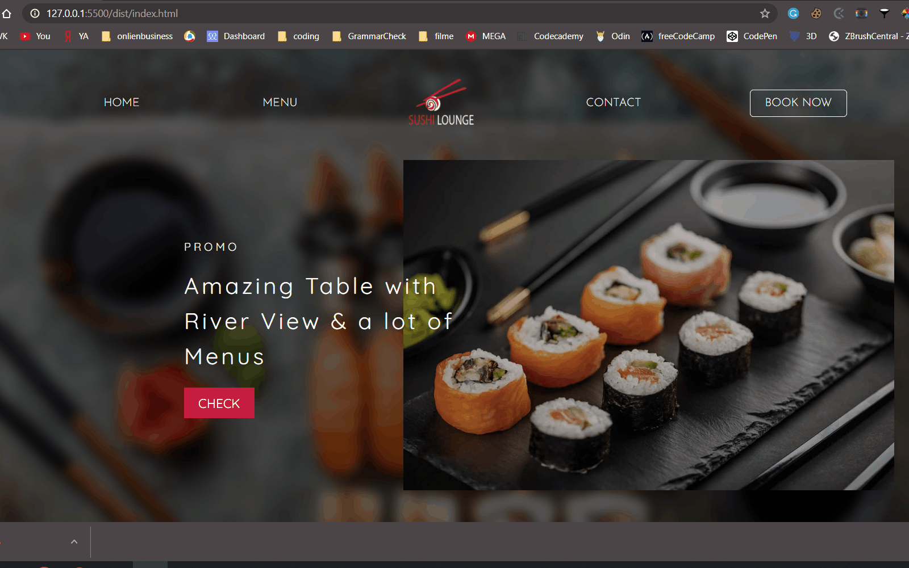

# Restaurant Page

In this project, I built a Simple Restuarant Page App using webpack to practice DOM manipulation by dynamically rendering its various pages: Home, Menu, and Contact.



## Live Demo

[Live view](https://raw.githack.com/vmwhoami/restaurant_page/exportImport/dist/index.html)

## Built With

- HTML
- JavaScript
- SCSS
- Flexbox

## Getting Started

To get a local copy of the repository please run the following commands on your terminal:

```bash
$ cd <folder>
$ git clone https://github.com/vmwhoami/restaurant_page
$ cd restaurant-page
```

## Author

**Vitalie Melnic**

- Github: [@vmwhoami](https://github.com/vmwhoami/)
- Twitter: [@vmwhoami](https://twitter.com/vmwhoami)
- Linkedin: [vitalie-melnic](https://www.linkedin.com/in/vitalie-melnic/)

## 🤝 Contributing

Contributions, issues and feature requests are welcome!

Feel free to check the [issues page](https://github.com/vmwhoami/restaurant_page/issues).

## Show your support

Give a ⭐️ if you like this project!
